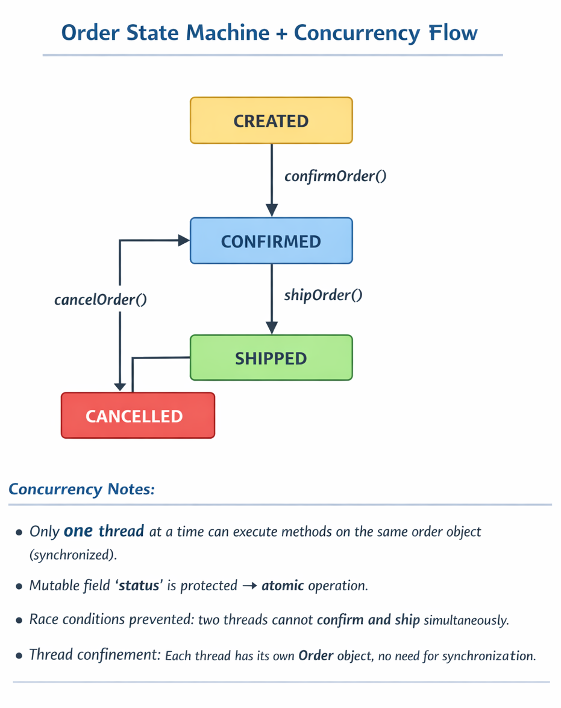

# Notes – Raymark 
Last Update: 2026-02-20

---

# Professional Rule

## Visibility order (from strongest to weakest exposure):

- private → only this class
- protected → this class + subclasses
- package-private → this package
- public → everyone

### You choose the minimum necessary visibility!

## 1. Core OOP Concepts Practiced

### Encapsulation
- I practiced **encapsulation** by keeping fields private and controlling access through **setter and getter methods**.
- Encapsulation is not only about private fields, but about enforcing invariants(invariants are the "sanity rules" for an object's state that must always be true for that object to be considered valid) and protecting object state through controlled behavior.
- This protects internal state and enforces rules. Example: `Order` status should not be updated directly; it must follow business rules.

### Behavioral Abstraction
- The abstraction I practiced is mostly **behavioral abstraction**:
  - Each class or enum **hides its internal logic** and exposes only meaningful actions.
  - Example: `OrderStatus` enum encapsulates the state transitions, and the `Order` class exposes methods like `confirmOrder()`, `shipOrder()`, `cancelOrder()`.
  - Consumers don’t need to know how the state is managed internally, only how to trigger behaviors.

### Abstraction + Encapsulation Together
- Combining **behavioral abstraction** with **encapsulation** makes the design clean, maintainable, and scalable.
- Misuse or incorrect state changes are prevented automatically.

---

## 2. Key Java Keywords

- **public**: Allows access from anywhere, making methods like `getStatus()` callable outside the class.  
- **static**: Belongs to the class, not the instance. Useful for enums or utility methods.  
- **synchronized**: Ensures **only one thread at a time** can execute a method on the same object. Critical for thread safety.

---

## 3. Concurrency Concepts (Priority Section)

### Thread Access vs Thread Confinement
- **Thread access**: When multiple threads try to modify the same object concurrently.
- **Thread confinement**: When each thread has its own object, no sharing occurs → safe by default.

### Mutable vs Immutable Objects
- **Mutable objects**: Internal state can change. Efficient, reusable, but require careful thread safety handling (`synchronized` or locks).  
- **Immutable objects**: State cannot change after creation. Thread-safe by default but may increase memory usage if many updates are needed.

### Race Condition
- Occurs when **two threads try to modify the same object at the same time** without proper synchronization.
- Leads to unpredictable behavior or corrupted state.

### Atomicity
- **Atomicity** means an operation happens **completely or not at all**, without being interrupted by other threads.
- Example: Updating a counter or changing an order’s status in a single **synchronized method** ensures atomicity.
- Lack of atomicity can lead to **race conditions** even with simple operations like `counter++`.

### How I Practiced Preventing Race Conditions
- Used **synchronized** methods in `Order` class to protect mutable `status` field.
- Thread-safe design prevents two threads from confirming/shipping/cancelling an order at the same time.
- Demonstrates **controlled thread access** using locks (implicit via `synchronized`) and guarantees **atomic operations**.

---

## 4. Exceptions & Business Rules

- **IllegalStateException** and **IllegalArgumentException** enforce correctness:
  - Example: `Order` cannot be shipped if not confirmed.
  - Example: Username cannot contain numbers.
- Exceptions are part of **encapsulation** because they enforce **state integrity** at the object level.

---

## 5. Behavioral Abstraction + Concurrency Insight

- Using enums as **state machines** is a perfect example of **behavioral abstraction + encapsulation**:
  - Each state knows what transitions are allowed.  
  - Code outside doesn’t need to check `if(status == CREATED)` manually.  
  - Avoids messy `if-else` chains and reduces chance of race conditions.

- Synchronized methods + immutable enum constants = safe, scalable, and clean design.

  ### Order State Machine + Concurrency Flow

---

## 6. Reflection & Mental Shift

- Before: I thought concurrency was just “threads running together.”  
- Now: I understand **thread behavior**, **mutable vs immutable objects**, **atomicity**, and how **behavioral abstraction + encapsulation** can make a system safe in parallel execution.
- Understanding **race conditions, thread confinement, and synchronized** has changed how I design objects.
- I realize that when using reuseable mutable object, you need reset it. Remove the stale data and update the state
- If one mutating methods uses synchronized, All mutating methods should use it. Also, please future me validate first before you mutate a mutable object.

### Important Design Principle

Never add getters and setters automatically.

Instead ask:

Should this value be readable?

Should this value be mutable?

Does exposing this break object integrity?

Good OOP is about control, not just syntax.
  
---

## 7. Future Exploration

- Explore `ReentrantLock` for more flexible locking  
- Atomic variables (`AtomicInteger`, etc.)  
- Thread pools and parallel streams  
- Distributed systems and how concurrency scales beyond single JVM

---

## 🔹 Key Terms Highlighted
- **Immutable and mutable objects**  
- **Encapsulation**  
- **Behavioral abstraction**  
- **Thread confinement**  
- **Thread access**  
- **Synchronized**  
- **Atomicity**  
- **Race condition**  
- **Setter and getter methods**  
- **Illegal exceptions**  
- **Public and static keyword**
